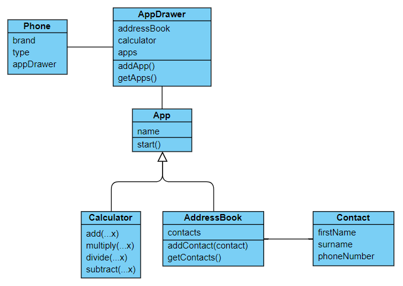

## Lab 8 - Classes

Design a JavaScript application with the following structure:

**Phone**
* It has a brand, a name and an AppDrawer.
* Its constructor initializes the instance by
	* creating a new instance of an AppDrawer;
	* adding an instance of a Calculator and an instance of an AddressBook to its AppDrawer.

**AppDrawer**
* It has a collection of Apps.
* It has a method to add an App.  
The method should check if the item type is App and if not it should throw an error.
* It can be iterated.
* It has a read only property that returns the Calculator instance.
* It has a read only property that returns the AddressBook instance.

**App**
* It is an abstract class.  
It should throw an error if directly instantiated.
* It has a name property.
* It has a start method.  
The method should log the name of the app to the console.
* The constructor should accept a name and it should initialize the name property.

**Calculator**
* It is an App.
* It initializes itself with a "Calculator" name, passing it to the constructor of its base class.
* It has four methods: Add, Subtract, Multiply and Divide.  
These four methods accept a variable list of numbers and return the result of the corresponding operation performed on the parameters.

**AddressBook**
* It is an App.
* It has a collection of Contact.
* It has a method to add a Contact.
The method should throw an error if the item to add is not a contact
* It is iterable.
* It has an iterable method "where" that accepts a function parameter
	* The function should accept a Contact and return a Boolean.
	* The Boolean should be true if the Contact has to be returned by the where method.
	* For each contact, the where method should:
		* invoke the function passing the Contact as an argument;
		* yield the Contact if the function returns true.

**Contact**
* It has a name.
* It has a surname.
* It has a phone number.

Write a Javascript application that:
* Creates an instance of a Phone.
* Adds 4 contacts to the address book of the phone.
* Logs to the console all the contacts of the address book.
* Logs to the console the contacts whose phone number includes a "06".
* Invokes the add method of the calculator app of the phone and logs the result to the console.

Note

You will need the polyfill.js file from a Babel polyfill installation. The easiest way to get this is to run npm install babel-polyfill (you already did this during lab1), then copy the polyfill.js file from the dist directory in the installed module (you did this during lab 09).
Once you have polyfill.js, include it in your page via a script tag. In order for the polyfill to work, it must be included before any compiled ES2015 code from Babel.

 